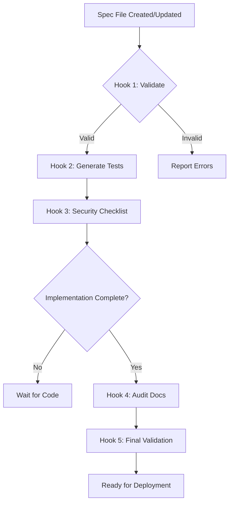

# Agent Hooks Architecture

## Overview

Agent Hooks are the automation engine of ChainSpec. They automatically trigger when specifications are created or updated, generating tests, documentation, and validation checks without manual intervention.

## Hook Categories

### 1. Pre-Development Hooks
Triggered during the specification phase, before any code is written.

### 2. Development Hooks  
Triggered when code is generated or modified.

### 3. Post-Development Hooks
Triggered after implementation, for validation and documentation.

---

## Hook Specifications

### Hook 1: Spec Validation Hook

**Trigger**: When a new `.md` spec file is created or modified in `kiro/` folder

**Purpose**: Validate that the specification is complete and follows best practices

**Actions**:
1. Check for required sections:
   - Contract Name
   - Security Requirements
   - Function specifications
   - State Variables
   - Events
   - State Invariants

2. Validate function specs have:
   - Description
   - Preconditions
   - Postconditions
   - Security considerations
   - Return values

3. Security checklist validation:
   - Access control specified for privileged functions
   - Reentrancy protection considered
   - State invariants documented
   - Event emissions specified

**Output**:
```json
{
  "valid": true,
  "completeness": 95,
  "warnings": [
    "Function 'mint' missing gas optimization notes",
    "Consider documenting upgrade strategy"
  ],
  "errors": []
}
```

**Integration Point**: `src/hooks/spec-validator.ts`

---

### Hook 2: Test Generation Hook

**Trigger**: When function specification is completed in spec file

**Purpose**: Automatically generate comprehensive test suite from specifications

**Actions**:
1. **Unit Tests Generation**:
   ```typescript
   // From spec precondition: "Caller must be owner"
   it("should allow owner to mint", async () => {
     await expect(contract.connect(owner).mint(user.address, 1000))
       .to.not.be.reverted;
   });
   
   it("should revert if non-owner tries to mint", async () => {
     await expect(contract.connect(attacker).mint(user.address, 1000))
       .to.be.revertedWith("Not owner");
   });
   ```

2. **Security Tests Generation**:
   ```typescript
   // From spec: "No reentrancy vulnerabilities"
   it("should prevent reentrancy attacks", async () => {
     const attacker = await deployReentrancyAttacker();
     await expect(attacker.attack(contract.address))
       .to.be.revertedWith("ReentrancyGuard");
   });
   ```

3. **State Invariant Tests**:
   ```typescript
   // From spec: "totalSupply == sum(balances)"
   it("should maintain supply invariant after transfers", async () => {
     // Execute multiple transfers
     const sumOfBalances = await calculateTotalBalances();
     const totalSupply = await contract.totalSupply();
     expect(sumOfBalances).to.equal(totalSupply);
   });
   ```

**Output**: `contracts/test/<ContractName>.test.js`

**Integration Point**: `src/generators/test-generator.ts`

---

### Hook 3: Security Checklist Hook

**Trigger**: When all function specs are completed for a contract

**Purpose**: Generate comprehensive security checklist for auditors

**Actions**:
1. Extract security requirements from spec
2. Generate verification checklist
3. Create threat model based on function interactions
4. Produce access control matrix

**Output**: `docs/audit/<ContractName>-security-checklist.md`

Example:
```markdown
# Security Checklist: DAOVault

## Access Control
- [ ] Only admin can pause/unpause
- [ ] Only strategist can execute strategies
- [ ] Role grants properly logged

## Reentrancy
- [ ] All external calls protected
- [ ] State updates before external calls
- [ ] SafeERC20 used for token transfers

## State Invariants
- [ ] Balance sum <= token balance
- [ ] Timelock enforced correctly
- [ ] Paused state prevents deposits

## Gas Optimization
- [ ] No unbounded loops
- [ ] Storage access minimized
- [ ] Events efficiently emitted
```

**Integration Point**: `src/generators/security-checklist-generator.ts`

---

### Hook 4: Audit Documentation Hook

**Trigger**: When contract implementation is complete

**Purpose**: Generate complete audit-ready documentation

**Actions**:
1. **Contract Overview**:
   - Purpose and use cases
   - Complexity rating
   - Security level classification

2. **Function Analysis**:
   - For each function:
     - Purpose
     - Access control
     - Security measures
     - Gas consumption
     - Test coverage

3. **Architecture Diagram**:
   - State machine visualization
   - Function interaction graph
   - External dependencies

4. **Test Coverage Report**:
   - Unit test count and coverage
   - Security test coverage
   - Integration test coverage

5. **Risk Assessment**:
   - Critical risks (if any)
   - High/Medium/Low risk findings
   - Mitigation strategies

**Output**: `docs/audit/<ContractName>-audit-report.md`

**Integration Point**: `src/generators/audit-doc-generator.ts`

---

### Hook 5: Code Generation Hook

**Trigger**: When specification is finalized and validated

**Purpose**: Generate Solidity contract skeleton from specification

**Actions**:
1. Load appropriate template (ERC20, DAO Vault, etc.)
2. Inject contract name, state variables, events
3. Generate function signatures with modifiers
4. Add NatSpec documentation from spec
5. Insert TODO comments for implementation
6. Add require statements from preconditions

**Output**: `contracts/generated/<ContractName>.sol`

**Example Generated Code**:
```solidity
/**
 * @notice Create new tokens and assign them to an address
 * @dev Security: Only owner can call
 */
function mint(address to, uint256 amount) 
    public 
    onlyOwner 
    returns (bool) 
{
    // Precondition: Caller must be owner
    require(msg.sender == owner, "Not owner");
    
    // TODO: Implement function logic
    // _mint(to, amount);
    
    // Postcondition: Balance increased, supply increased
    // emit Transfer(address(0), to, amount);
    
    return true;
}
```

**Integration Point**: `src/generator/generator.ts` (Already implemented!)

---

## Hook Execution Flow



## Implementation Architecture

### File Watcher
```typescript
// src/hooks/watcher.ts
import chokidar from 'chokidar';

const watcher = chokidar.watch('kiro/**/*.md', {
  persistent: true
});

watcher.on('change', async (path) => {
  console.log(`Spec changed: ${path}`);
  await triggerHooks(path);
});
```

### Hook Registry
```typescript
// src/hooks/registry.ts
interface Hook {
  name: string;
  trigger: HookTrigger;
  action: (context: HookContext) => Promise<void>;
}

const hooks: Hook[] = [
  {
    name: 'spec-validator',
    trigger: HookTrigger.SPEC_MODIFIED,
    action: validateSpec
  },
  {
    name: 'test-generator',
    trigger: HookTrigger.SPEC_COMPLETE,
    action: generateTests
  },
  // ... more hooks
];
```

### Hook Executor
```typescript
// src/hooks/executor.ts
async function executeHooks(trigger: HookTrigger, context: HookContext) {
  const applicableHooks = hooks.filter(h => h.trigger === trigger);
  
  for (const hook of applicableHooks) {
    try {
      await hook.action(context);
      console.log(`✅ ${hook.name} completed`);
    } catch (error) {
      console.error(`❌ ${hook.name} failed:`, error);
    }
  }
}
```

## Configuration

### `chainspec.config.json`
```json
{
  "hooks": {
    "enabled": true,
    "autoRun": true,
    "hooks": [
      {
        "name": "spec-validator",
        "enabled": true,
        "runOn": ["create", "update"]
      },
      {
        "name": "test-generator",
        "enabled": true,
        "runOn": ["spec-complete"]
      }
    ]
  },
  "paths": {
    "specs": "kiro/",
    "contracts": "contracts/",
    "tests": "contracts/test/",
    "docs": "docs/"
  }
}
```

## Future Enhancements

### Advanced Hooks
1. **Gas Optimization Hook**: Analyze and suggest gas optimizations
2. **Upgrade Path Hook**: Generate upgrade-safe patterns
3. **Formal Verification Hook**: Convert to formal verification language
4. **Multi-Language Hook**: Generate tests in multiple frameworks

### AI-Powered Hooks
1. **Vulnerability Detection**: AI scans for common vulnerability patterns
2. **Code Completion**: AI suggests implementation based on spec
3. **Test Case Expansion**: AI generates edge case tests
4. **Documentation Enhancement**: AI improves documentation clarity

---

*This architecture enables ChainSpec to automate 70% of the development workflow, allowing developers to focus on business logic while security is handled systematically.*
