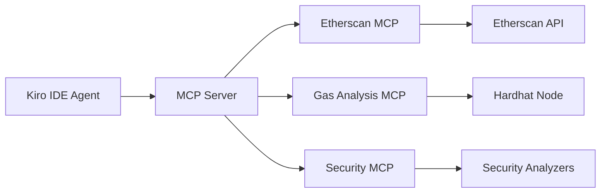

# Custom MCP (Model Context Protocol) Design

## Overview

ChainSpec implements three custom MCPs to integrate with the Ethereum ecosystem and provide real-time blockchain data, gas analysis, and security validation.

## MCP Architecture



---

## MCP 1: Etherscan Integration MCP

### Purpose
Provide real-time access to deployed contract data, verification status, and on-chain information.

### Capabilities

#### 1. Contract ABI Retrieval
```typescript
interface EtherscanMCP {
  // Get contract ABI from Etherscan
  getContractABI(address: string, network: string): Promise<ABI>;
  
  // Example usage:
  const abi = await etherscan.getContractABI(
    "0x1f9840a85d5aF5bf1D1762F925BDADdC4201F984", // UNI token
    "mainnet"
  );
}
```

**Use Case**: Import existing contracts for analysis or interaction

#### 2. Source Code Verification
```typescript
interface VerificationMCP {
  // Verify contract on Etherscan
  verifyContract(params: VerificationParams): Promise<VerificationResult>;
  
  // Check verification status
  checkVerification(address: string): Promise<boolean>;
}

interface VerificationParams {
  address: string;
  sourceCode: string;
  contractName: string;
  compilerVersion: string;
  optimizationUsed: boolean;
  constructorArguments?: string;
}
```

**Use Case**: Auto-verify deployed contracts on block explorers

#### 3. Transaction Analysis
```typescript
interface TransactionMCP {
  // Get transaction details
  getTransaction(txHash: string): Promise<Transaction>;
  
  // Get contract creation transaction
  getContractCreation(address: string): Promise<CreationTx>;
  
  // Analyze transaction gas usage
  analyzeGasUsage(txHash: string): Promise<GasAnalysis>;
}
```

**Use Case**: Debug deployments and analyze on-chain behavior

#### 4. Contract State Queries
```typescript
interface StateMCP {
  // Read contract state
  readState(address: string, slot: number): Promise<string>;
  
  // Get event logs
  getEvents(address: string, eventSignature: string): Promise<Log[]>;
  
  // Get token balances
  getTokenBalance(token: string, holder: string): Promise<BigNumber>;
}
```

**Use Case**: Validate deployed contract state matches specifications

### Implementation

```typescript
// src/mcps/etherscan-mcp.ts
import axios from 'axios';

export class EtherscanMCP {
  private apiKey: string;
  private baseURL: string;
  
  constructor(network: 'mainnet' | 'sepolia' | 'goerli') {
    this.apiKey = process.env.ETHERSCAN_API_KEY!;
    this.baseURL = this.getBaseURL(network);
  }
  
  async getContractABI(address: string): Promise<any> {
    const response = await axios.get(this.baseURL, {
      params: {
        module: 'contract',
        action: 'getabi',
        address: address,
        apikey: this.apiKey
      }
    });
    
    if (response.data.status === '1') {
      return JSON.parse(response.data.result);
    }
    throw new Error('Contract not verified');
  }
  
  async verifyContract(params: VerificationParams): Promise<string> {
    // Submit source code for verification
    const response = await axios.post(this.baseURL, {
      module: 'contract',
      action: 'verifysourcecode',
      ...params,
      apikey: this.apiKey
    });
    
    return response.data.result; // Returns GUID
  }
  
  async checkVerification(guid: string): Promise<VerificationStatus> {
    const response = await axios.get(this.baseURL, {
      params: {
        module: 'contract',
        action: 'checkverifystatus',
        guid: guid,
        apikey: this.apiKey
      }
    });
    
    return response.data.result;
  }
}
```

---

## MCP 2: Gas Estimation MCP

### Purpose
Analyze gas consumption, estimate costs, and suggest optimizations for smart contract functions.

### Capabilities

#### 1. Function Gas Estimation
```typescript
interface GasMCP {
  // Estimate gas for a function call
  estimateGas(
    contract: string,
    functionName: string,
    params: any[]
  ): Promise<GasEstimate>;
}

interface GasEstimate {
  gasUsed: number;
  gasCost: {
    gwei: number;
    eth: number;
    usd: number;
  };
  breakdown: GasBreakdown[];
}
```

**Example Output**:
```json
{
  "gasUsed": 45230,
  "gasCost": {
    "gwei": 905,
    "eth": 0.00090,
    "usd": 2.15
  },
  "breakdown": [
    { "operation": "SSTORE", "gas": 20000, "count": 1 },
    { "operation": "SLOAD", "gas": 2100, "count": 3 },
    { "operation": "CALL", "gas": 9000, "count": 1 }
  ]
}
```

#### 2. Deployment Cost Analysis
```typescript
interface DeploymentMCP {
  // Estimate deployment cost
  estimateDeployment(bytecode: string): Promise<DeploymentCost>;
}

interface DeploymentCost {
  gasUsed: number;
  bytecodeSize: number;
  costInUSD: number;
  optimization: {
    enabled: boolean;
    runs: number;
    potentialSavings?: number;
  };
}
```

#### 3. Optimization Suggestions
```typescript
interface OptimizationMCP {
  // Analyze contract for gas optimizations
  analyzeOptimizations(sourceCode: string): Promise<Optimization[]>;
}

interface Optimization {
  type: 'storage' | 'computation' | 'pattern';
  location: { file: string; line: number };
  issue: string;
  suggestion: string;
  potentialSavings: number;
}
```

**Example Suggestions**:
```typescript
[
  {
    type: 'storage',
    location: { file: 'ERC20.sol', line: 45 },
    issue: 'Repeated SLOAD from storage',
    suggestion: 'Cache totalSupply in memory',
    potentialSavings: 2100 // gas units
  },
  {
    type: 'pattern',
    location: { file: 'ERC20.sol', line: 67 },
    issue: 'Using += operator on storage variables',
    suggestion: 'Use unchecked { } for gas savings',
    potentialSavings: 1500
  }
]
```

### Implementation

```typescript
// src/mcps/gas-mcp.ts
import { ethers } from 'ethers';

export class GasMCP {
  private provider: ethers.Provider;
  
  async estimateGas(
    contractAddress: string,
    functionName: string,
    params: any[]
  ): Promise<GasEstimate> {
    const contract = new ethers.Contract(contractAddress, abi, this.provider);
    const gasEstimate = await contract[functionName].estimateGas(...params);
    
    // Get current gas price
    const gasPrice = await this.provider.getFeeData();
    const gasCostWei = gasEstimate * gasPrice.gasPrice!;
    
    return {
      gasUsed: Number(gasEstimate),
      gasCost: {
        gwei: Number(gasCostWei) / 1e9,
        eth: Number(ethers.formatEther(gasCostWei)),
        usd: await this.convertToUSD(Number(ethers.formatEther(gasCostWei)))
      }
    };
  }
  
  async analyzeOptimizations(sourceCode: string): Promise<Optimization[]> {
    const optimizations: Optimization[] = [];
    
    // Pattern: Repeated storage reads
    const storageReads = this.findRepeatedStorageReads(sourceCode);
    optimizations.push(...storageReads);
    
    // Pattern: Unnecessary checks
    const unnecessaryChecks = this.findUnnecessaryChecks(sourceCode);
    optimizations.push(...unnecessaryChecks);
    
    // Pattern: Inefficient loops
    const inefficientLoops = this.findInefficientLoops(sourceCode);
    optimizations.push(...inefficientLoops);
    
    return optimizations;
  }
}
```

---

## MCP 3: Security Analysis MCP

### Purpose
Real-time security validation against common vulnerabilities and best practices.

### Capabilities

#### 1. Reentrancy Detection
```typescript
interface ReentrancyMCP {
  // Check for reentrancy vulnerabilities
  checkReentrancy(sourceCode: string): Promise<ReentrancyCheck>;
}

interface ReentrancyCheck {
  vulnerable: boolean;
  findings: ReentrancyFinding[];
}

interface ReentrancyFinding {
  function: string;
  line: number;
  issue: string;
  severity: 'critical' | 'high' | 'medium';
  recommendation: string;
}
```

**Example Output**:
```json
{
  "vulnerable": true,
  "findings": [
    {
      "function": "withdraw",
      "line": 45,
      "issue": "External call before state update",
      "severity": "critical",
      "recommendation": "Update balance before calling transfer()"
    }
  ]
}
```

#### 2. Access Control Validation
```typescript
interface AccessControlMCP {
  // Validate access control implementation
  validateAccessControl(
    spec: ContractSpec,
    sourceCode: string
  ): Promise<AccessControlCheck>;
}

interface AccessControlCheck {
  compliant: boolean;
  findings: AccessControlFinding[];
}
```

#### 3. State Invariant Verification
```typescript
interface InvariantMCP {
  // Verify state invariants are maintained
  verifyInvariants(
    spec: ContractSpec,
    testResults: TestResults
  ): Promise<InvariantCheck>;
}
```

#### 4. Common Vulnerability Scanning
```typescript
interface VulnerabilityMCP {
  // Scan for common vulnerabilities
  scanVulnerabilities(sourceCode: string): Promise<VulnerabilityReport>;
}

interface VulnerabilityReport {
  score: number; // 0-100
  vulnerabilities: Vulnerability[];
}

interface Vulnerability {
  type: VulnerabilityType;
  severity: 'critical' | 'high' | 'medium' | 'low';
  location: string;
  description: string;
  mitigation: string;
}

enum VulnerabilityType {
  REENTRANCY = 'reentrancy',
  INTEGER_OVERFLOW = 'integer-overflow',
  UNCHECKED_CALL = 'unchecked-call',
  DELEGATECALL = 'delegatecall-to-untrusted',
  TX_ORIGIN = 'tx-origin-auth',
  TIMESTAMP_DEPENDENCE = 'timestamp-dependence',
  UNINITIALIZED_STORAGE = 'uninitialized-storage'
}
```

### Implementation

```typescript
// src/mcps/security-mcp.ts
export class SecurityMCP {
  
  async checkReentrancy(sourceCode: string): Promise<ReentrancyCheck> {
    const findings: ReentrancyFinding[] = [];
    
    // Parse AST
    const ast = this.parseContract(sourceCode);
    
    // Look for pattern: external call before state change
    for (const func of ast.functions) {
      const externalCalls = this.findExternalCalls(func);
      const stateChanges = this.findStateChanges(func);
      
      for (const call of externalCalls) {
        const dangerousStateChanges = stateChanges.filter(
          change => change.line > call.line
        );
        
        if (dangerousStateChanges.length > 0) {
          findings.push({
            function: func.name,
            line: call.line,
            issue: 'State updated after external call',
            severity: 'critical',
            recommendation: 'Move state updates before external calls'
          });
        }
      }
    }
    
    return {
      vulnerable: findings.length > 0,
      findings
    };
  }
  
  async scanVulnerabilities(sourceCode: string): Promise<VulnerabilityReport> {
    const vulnerabilities: Vulnerability[] = [];
    
    // Check for tx.origin usage
    vulnerabilities.push(...this.checkTxOrigin(sourceCode));
    
    // Check for unchecked external calls
    vulnerabilities.push(...this.checkUncheckedCalls(sourceCode));
    
    // Check for delegatecall to untrusted addresses
    vulnerabilities.push(...this.checkDelegatecall(sourceCode));
    
    // Calculate security score
    const score = this.calculateSecurityScore(vulnerabilities);
    
    return { score, vulnerabilities };
  }
}
```

---

## MCP Server Setup

### Configuration

```json
{
  "mcpServers": {
    "etherscan": {
      "command": "node",
      "args": ["dist/mcps/etherscan-mcp.js"],
      "env": {
        "ETHERSCAN_API_KEY": "${ETHERSCAN_API_KEY}",
        "NETWORK": "sepolia"
      }
    },
    "gas-analyzer": {
      "command": "node",
      "args": ["dist/mcps/gas-mcp.js"],
      "env": {
        "RPC_URL": "${RPC_URL}"
      }
    },
    "security-scanner": {
      "command": "node",
      "args": ["dist/mcps/security-mcp.js"]
    }
  }
}
```

### Integration with Kiro IDE

The MCPs are accessible through Kiro's agent interface:

```typescript
// In Kiro Agent
const etherscan = await useMCP('etherscan');
const abi = await etherscan.getContractABI(contractAddress);

const gas = await useMCP('gas-analyzer');
const estimate = await gas.estimateGas(contract, 'mint', [address, amount]);

const security = await useMCP('security-scanner');
const report = await security.scanVulnerabilities(sourceCode);
```

---

## Benefits

1. **Real-Time Data**: Access live blockchain data during development
2. **Automated Verification**: Auto-verify deployments on Etherscan
3. **Cost Awareness**: Know gas costs before deployment
4. **Security First**: Catch vulnerabilities during development
5. **Single Interface**: All tools accessible through Kiro IDE

---

*These MCPs transform ChainSpec from a local tool into a blockchain-connected development platform.*
