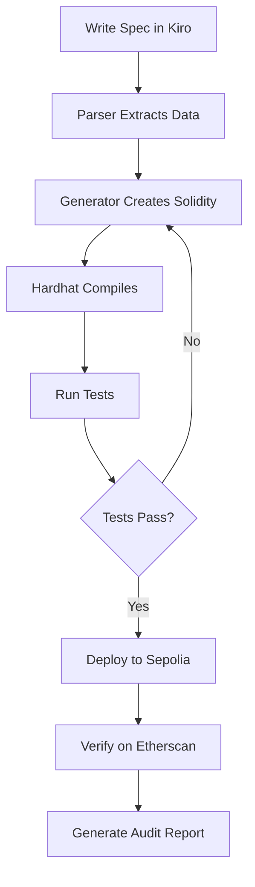

# Ethereum Integration Guide

## Overview

ChainSpec is built natively for Ethereum and EVM-compatible chains. This document explains how we integrate with the Ethereum ecosystem.

## Development Stack

### Core Tools

**Hardhat** - Development environment
```json
{
  "networks": {
    "sepolia": {
      "url": "${SEPOLIA_RPC_URL}",
      "accounts": ["${PRIVATE_KEY}"],
      "chainId": 11155111
    },
    "mainnet": {
      "url": "${MAINNET_RPC_URL}",
      "accounts": ["${PRIVATE_KEY}"],
      "chainId": 1
    }
  },
  "solidity": {
    "version": "0.8.20",
    "settings": {
      "optimizer": {
        "enabled": true,
        "runs": 200
      }
    }
  }
}
```

**Ethers.js** - Blockchain interaction
```typescript
import { ethers } from 'ethers';

const provider = new ethers.JsonRpcProvider(RPC_URL);
const wallet = new ethers.Wallet(PRIVATE_KEY, provider);
const contract = new ethers.Contract(address, abi, wallet);
```

**OpenZeppelin** - Security libraries
```solidity
import "@openzeppelin/contracts/token/ERC20/ERC20.sol";
import "@openzeppelin/contracts/access/Ownable.sol";
import "@openzeppelin/contracts/security/ReentrancyGuard.sol";
import "@openzeppelin/contracts/security/Pausable.sol";
```

## Smart Contract Standards

### ERC-20: Fungible Tokens
```solidity
interface IERC20 {
    function totalSupply() external view returns (uint256);
    function balanceOf(address account) external view returns (uint256);
    function transfer(address to, uint256 amount) external returns (bool);
    function allowance(address owner, address spender) external view returns (uint256);
    function approve(address spender, uint256 amount) external returns (bool);
    function transferFrom(address from, address to, uint256 amount) external returns (bool);
}
```

**ChainSpec Support**: Full template with security specifications

### ERC-721: Non-Fungible Tokens (NFTs)
```solidity
interface IERC721 {
    function ownerOf(uint256 tokenId) external view returns (address);
    function safeTransferFrom(address from, address to, uint256 tokenId) external;
    function approve(address to, uint256 tokenId) external;
    function setApprovalForAll(address operator, bool approved) external;
}
```

**ChainSpec Support**: Future template (post-hackathon)

### ERC-1155: Multi-Token Standard
**ChainSpec Support**: Future template (post-hackathon)

## Deployment Process

### 1. Compile Contracts
```bash
cd contracts
npx hardhat compile

# Output:
# Compiled 5 Solidity files successfully
```

### 2. Run Tests
```bash
npx hardhat test

# Output:
# ✓ ERC20 - constructor sets name and symbol
# ✓ ERC20 - mint increases balance and supply
# ✓ ERC20 - only owner can mint
# ...
# 20 passing (2s)
```

### 3. Deploy to Testnet
```typescript
// scripts/deploy.ts
import { ethers } from "hardhat";

async function main() {
  const [deployer] = await ethers.getSigners();
  
  console.log("Deploying with account:", deployer.address);
  console.log("Account balance:", await deployer.provider.getBalance(deployer.address));
  
  const MyToken = await ethers.getContractFactory("MyToken");
  const token = await MyToken.deploy("MyToken", "MTK");
  
  await token.waitForDeployment();
  const address = await token.getAddress();
  
  console.log("MyToken deployed to:", address);
  
  // Save deployment info
  const deployment = {
    network: "sepolia",
    address: address,
    deployer: deployer.address,
    timestamp: Date.now(),
    constructor: ["MyToken", "MTK"]
  };
  
  fs.writeFileSync(
    `deployments/sepolia-${Date.now()}.json`,
    JSON.stringify(deployment, null, 2)
  );
}

main().catch((error) => {
  console.error(error);
  process.exitCode = 1;
});
```

Run deployment:
```bash
npx hardhat run scripts/deploy.ts --network sepolia

# Output:
# Deploying with account: 0x1234...
# Account balance: 1000000000000000000
# MyToken deployed to: 0x5678...
```

### 4. Verify on Etherscan
```bash
npx hardhat verify --network sepolia 0x5678... "MyToken" "MTK"

# Output:
# Successfully verified contract MyToken on Etherscan
# https://sepolia.etherscan.io/address/0x5678...#code
```

## On-Chain Interactions

### Reading Contract State
```typescript
// Get token balance
const balance = await token.balanceOf(userAddress);
console.log(`Balance: ${ethers.formatEther(balance)} MTK`);

// Get total supply
const supply = await token.totalSupply();
console.log(`Total Supply: ${ethers.formatEther(supply)} MTK`);

// Get token metadata
const name = await token.name();
const symbol = await token.symbol();
const decimals = await token.decimals();
```

### Writing to Blockchain
```typescript
// Mint tokens (requires owner)
const tx = await token.mint(recipientAddress, ethers.parseEther("1000"));
console.log("Transaction hash:", tx.hash);

// Wait for confirmation
const receipt = await tx.wait();
console.log("Confirmed in block:", receipt.blockNumber);
console.log("Gas used:", receipt.gasUsed.toString());

// Listen for events
token.on("Transfer", (from, to, amount, event) => {
  console.log(`Transfer: ${from} -> ${to}: ${ethers.formatEther(amount)} MTK`);
});
```

## Gas Optimization

### Strategies

**1. Use `calldata` instead of `memory` for read-only arrays**
```solidity
// Bad (costs more gas)
function process(uint256[] memory data) external {
    // ...
}

// Good (cheaper)
function process(uint256[] calldata data) external {
    // ...
}
```

**2. Cache storage variables**
```solidity
// Bad (multiple SLOADs)
function update() external {
    require(balance > 0);
    require(balance < maxBalance);
    balance = balance + 1;
}

// Good (single SLOAD)
function update() external {
    uint256 _balance = balance;
    require(_balance > 0);
    require(_balance < maxBalance);
    balance = _balance + 1;
}
```

**3. Use unchecked for trusted arithmetic**
```solidity
// Solidity 0.8+ has automatic overflow checking
// For trusted arithmetic, use unchecked { }
function increment(uint256 x) external pure returns (uint256) {
    unchecked {
        return x + 1; // Saves ~200 gas
    }
}
```

## Security Best Practices

### 1. Checks-Effects-Interactions Pattern
```solidity
function withdraw(uint256 amount) external {
    // CHECKS
    require(balances[msg.sender] >= amount, "Insufficient balance");
    
    // EFFECTS
    balances[msg.sender] -= amount;
    
    // INTERACTIONS
    (bool success, ) = msg.sender.call{value: amount}("");
    require(success, "Transfer failed");
}
```

### 2. ReentrancyGuard
```solidity
import "@openzeppelin/contracts/security/ReentrancyGuard.sol";

contract MyVault is ReentrancyGuard {
    function withdraw(uint256 amount) external nonReentrant {
        // Safe from reentrancy
    }
}
```

### 3. Access Control
```solidity
import "@openzeppelin/contracts/access/AccessControl.sol";

contract MyContract is AccessControl {
    bytes32 public constant MINTER_ROLE = keccak256("MINTER_ROLE");
    
    constructor() {
        _grantRole(DEFAULT_ADMIN_ROLE, msg.sender);
        _grantRole(MINTER_ROLE, msg.sender);
    }
    
    function mint(address to, uint256 amount) 
        external 
        onlyRole(MINTER_ROLE) 
    {
        _mint(to, amount);
    }
}
```

## Network Support

### Mainnet (Production)
- **Chain ID**: 1
- **RPC**: `https://eth-mainnet.g.alchemy.com/v2/${API_KEY}`
- **Explorer**: https://etherscan.io
- **Gas**: Use gas price oracles

### Sepolia (Testnet)
- **Chain ID**: 11155111
- **RPC**: `https://eth-sepolia.g.alchemy.com/v2/${API_KEY}`
- **Explorer**: https://sepolia.etherscan.io
- **Faucet**: https://sepoliafaucet.com

### Goerli (Testnet - Deprecated)
Being phased out, use Sepolia instead

### Hardhat Local Network
```bash
npx hardhat node

# Output:
# Started HTTP and WebSocket JSON-RPC server at http://127.0.0.1:8545/
```

## ChainSpec Integration Points

### From Spec to Deployment



### Automated Deployment Script

```typescript
// ChainSpec automated deployment
async function deployFromSpec(specPath: string) {
  // 1. Parse spec
  const spec = SpecParser.parseSpecFile(specPath);
  
  // 2. Generate contract
  const contractPath = SolidityGenerator.generateFromSpec(spec);
  
  // 3. Compile
  await hre.run("compile");
  
  // 4. Run tests
  await hre.run("test");
  
  // 5. Deploy
  const deployment = await deploy(spec.contractName);
  
  // 6. Verify
  await verify(deployment.address, deployment.args);
  
  // 7. Generate report
  await generateAuditReport(spec, deployment);
  
  return deployment;
}
```

## Future Multi-Chain Support

**Post-Hackathon Roadmap**:
- Polygon (MATIC)
- Arbitrum (L2)
- Optimism (L2)
- Base (L2)
- Avalanche

All are EVM-compatible, require minimal changes to contracts.

---

*ChainSpec leverages the full Ethereum ecosystem to provide a seamless development experience from specification to verified deployment.*
